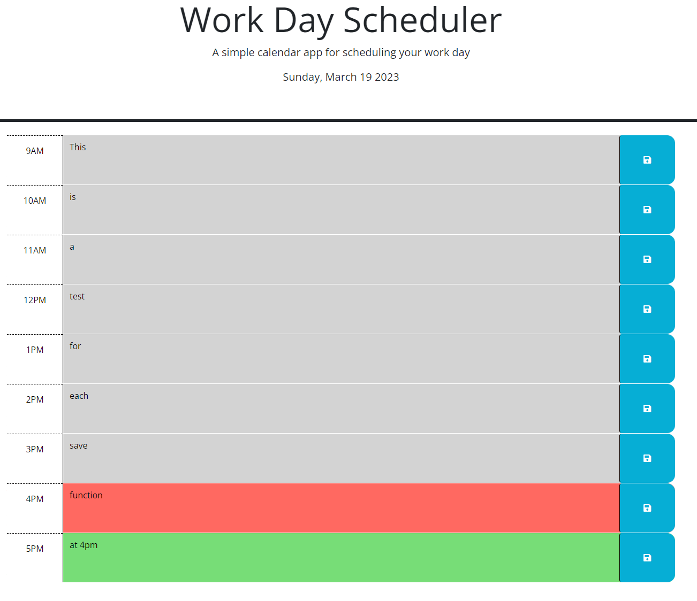

# Work-Day-Scheduler-RBC

## Description
Link to live app: https://eldenbear.github.io/RBC-Module-5/ 

This app is a work day scheduler that will save your inputs to local storage. It will color code based on the current, past, and future times. It also displays the current date.

## Usage
Here is a screenshot showing text in each field that has been saved to local storage.

